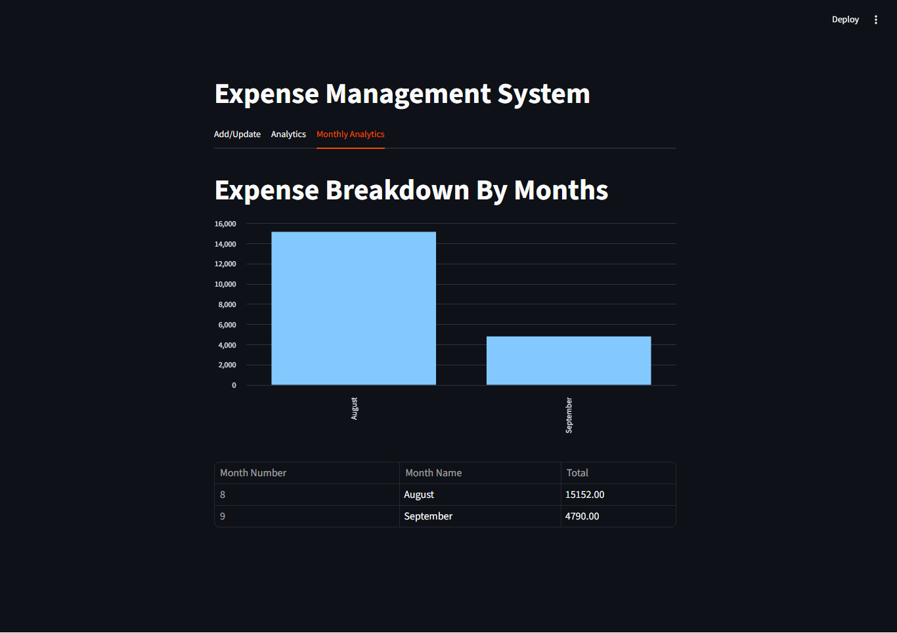

# 💸 Expense Management System – Simplify, Track, Thrive!

A smart, full-stack **expense tracking platform** built using **FastAPI** & **Streamlit**, designed to help individuals and small teams take control of their spending – with analytics that speak louder than spreadsheets.

---

## 🧠 Why This Project?

Everyone spends, but few actually track.  
This system helps you:

- 📊 Visualize where your money goes
- 📅 Analyze spending by month and category
- 🚀 Quickly add/update expenses via a friendly UI
- 🧠 Get insights that help build better financial habits

---

## ✨ Features

- ✅ Add & update daily expenses via the UI
- 📅 Monthly breakdown with category-wise insights
- 📊 Percentage distribution charts
- ⚡ Powered by FastAPI & PostgreSQL (or SQLite)
- 🧪 Basic testing for reliability
- 💻 Interactive Streamlit frontend

---

## 🚀 Getting Started

### 1️⃣ Clone the Repository

```bash
git clone https://github.com/Dhwani-02/expense-management-system.git
cd expense-management-system

2️⃣ Install Dependencies
bash
Copy
Edit
pip install -r requirements.txt
3️⃣ Run the FastAPI Server
bash
Copy
Edit
cd backend
uvicorn server.server:app --reload
➡ Visit: http://127.0.0.1:8000/docs to explore the API using Swagger UI.

4️⃣ Run the Streamlit App
bash
Copy
Edit
cd ../frontend
streamlit run app.py
➡ Open: http://localhost:8501 in your browser.

📸 Screenshots
🔹 Dashboard View


🔹 Datewise summery Analytics


🔹 Monthly Analytics


🧪 Running Tests
pytest tests/


