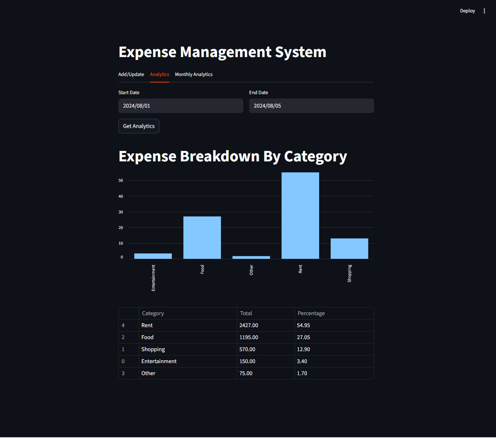

💸 Expense Management System – Simplify, Track, Thrive!
A smart, full-stack expense tracking platform built using FastAPI & Streamlit, designed to help individuals and small teams take control of their spending – with analytics that speak louder than spreadsheets.

🚀 Why This Project?
We all track expenses, but doing it manually is outdated and uninspiring.
This project merges the speed of FastAPI, the elegance of Streamlit, and the power of data to create a fast, responsive, and insightful experience – because your expenses deserve better.

🏗️ Project Architecture
pgsql
Copy
Edit
expense-management-system/
├── backend/       ⬅️ FastAPI server & APIs
├── frontend/      ⬅️ Streamlit UI app
├── tests/         ⬅️ Test cases for backend and frontend
├── requirements.txt
└── README.md
✨ Key Features
📊 Visual Expense Dashboard – Instant insights on where your money goes

🧠 Smart Analytics – Monthly category breakdown with percentage insights

🚀 FastAPI Backend – Lightning-fast endpoints to serve your data

💡 Streamlit Frontend – Clean, interactive UI built for usability

📅 Time-Range Filtering – View summaries between any date/month range

✅ Test-Driven – Includes basic testing suite for both frontend and backend

🔧 Setup Instructions
1. Clone the Repository
bash
git clone https://github.com/yourusername/expense-management-system.git
cd expense-management-system
2. Install All Dependencies
bash
pip install -r requirements.txt
3. Start the Backend (FastAPI)
bash
cd backend
uvicorn server.server:app --reload

🖥️ Visit: http://127.0.0.1:8000/docs for the interactive Swagger UI.

5. Start the Frontend (Streamlit)
bash
cd ..
streamlit run frontend/app.py
🖼️ Open: http://localhost:8501

📸 Screenshots
Add screenshots here of:

Monthly breakdown chart

API response in Swagger

Streamlit filters in action

✅ Sample API Request (POST /analytics/monthly/)
json
Copy
Edit
{
  "start_date": "2025-06-01",
  "end_date": "2025-07-31"
}
Response:

json
Copy
Edit
{
  "2025-06": {
    "Food": { "total": 1200, "percentage": 60.0 },
    "Transport": { "total": 800, "percentage": 40.0 }
  }
}
🧪 Run Tests
bash
Copy
Edit
pytest tests/
🌍 Ideal For:
Budget-conscious individuals 🧑‍💼

Small teams tracking shared expenses 👥

Data-driven learners 👩‍💻

Portfolio showcase for developers 🚀

🙋‍♂️ Want to Contribute?
Contributions, ideas, and issue reports are welcome!
Fork the repo, create a feature branch, and send a pull request.

