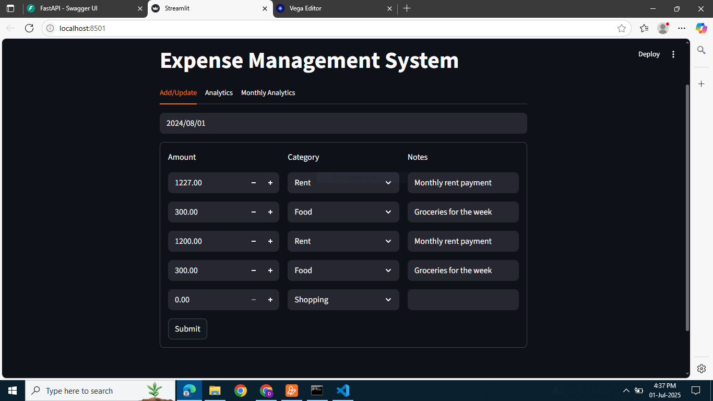

# Expense Management System – Simplify, Track, Thrive!

A smart, full-stack **expense tracking platform** built using **FastAPI** & **Streamlit**, designed to help individuals and small teams take control of their spending – with analytics that speak louder than spreadsheets.

---

## Why This Project?

Everyone spends, but few actually track.  
This system helps you:

- Visualize where your money goes
- Analyze spending by month and category
- Quickly add/update expenses via a friendly UI
- Get insights that help build better financial habits

---

## Features

- Add & update daily expenses via the UI
- Monthly breakdown with category-wise insights
- Percentage distribution charts
- Powered by FastAPI & PostgreSQL (or SQLite)
- Basic testing for reliability
- Interactive Streamlit frontend

---

## Getting Started

### Clone the Repository

bash
git clone https://github.com/Dhwani-02/expense-management-system.git
cd expense-management-system

1. Install Dependencies
bash pip install -r requirements.txt

2. Run the FastAPI Server
bash cd backend
uvicorn server.server:app --reload

➡ Visit: http://127.0.0.1:8000/docs to explore the API using Swagger UI.

3. Run the Streamlit App
bash cd ../frontend streamlit run app.py

➡ Open: http://localhost:8501 in your browser.

## Screenshots

### Dashboard View

### Datewise summery Analytics

### Monthly Analytics

## Running Tests
pytest tests/

## Contributing
 Want to suggest a feature or fix a bug?

 Fork the repo

 Create a new branch: feature/my-feature

 Commit your changes

 Submit a Pull Request 

 ## Author

 Built with ❤️ by Dhwani Zala
 - Contact: dhwanizala25@gmail.com
 - Portfoilo: https://dhwanizala-portfolio.dcms.site/
 - LinkedIn: https://www.linkedin.com/in/dhwani-zala-276a2a213/

